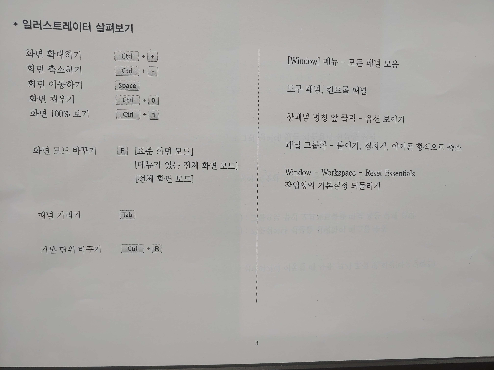

## 03) 일러스트레이터 살펴보기
- - -

## 새문서
 + [ctl+n] : 새로 만들기
 + Color mode
   - 스크린 : RGB
   - 인쇄 : CMYK
 + Raster Effects
   - RGB (보통 72ppi)
   - CMYK (보통 150ppi)
   
- - -

## 저장 확장자
 + 확장자
   - ai(기본)
   - pdf, eps, jpg, png 저장 가능
   
- - -

## 단축키 및 사용팁
 + [눈금자 보기] : ctrl + r
 + [눈금자 기준점 맞추기] : 눈금자 좌측 끝 구석 클릭 후 용지 끝부분 맞추기
 + [단위 바꾸기] : 눈금자 우클릭 - 해당 단위로 바꾸기 (일러스트레이터 기본:mm)
 + [화면 채우기] : crl + 0 | Hand Tool icon 더블 클릭
 + [화면 100% 보기] : ctrl + 1 | Zoom Tool icon 더블 클릭
 + [화면모드바꾸기] : f
 + [일시적 Hand Tool 사용] : space
 + [확대] : ctrl + +
 + [축소] : ctrl + -
 + [패널 가리기] : tab
 
- - -

## Tool 팁
 + 사용하고자 하는 해당 Tool icon 길게 왼클릭 - 화살표 표시로 패널 분리 가능
 

